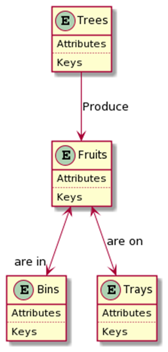

I believe that we have to standardise and integrate our data now to understand
the ever-growing complexity of science projects. The application of ontologies
had been trialed many times in other science domains, such as environmental 
modelling and ecology. The early we start to build our ontologies, the sooner
we will benefit from them. 

# What is ontology

The term may make people think that this is just another jargon that the data 
science people use to make them sounds like the cool kids. It is not the case.
ONTOLOGY is a term well defined many moons ago by World Wide Web Consortium (W3C).
In short, the word ONTOLOGY in the information science domain shares similar 
meaning as the word VOCABULARY. But with more formalisation in it to strictly 
define relationships between concepts. Therefore, less chance to form ambiguities
which are the main difficulties for computers to help us integrate and merge data
without much human input. For example, we know that an apple is from an apple 
tree, and it is probably placed in a bin or tray when the apple is picked. But
computers have no common knowledge to understand information that we gained from 
life experience. So how can we incorporate our common sense into the system that 
make computers understand the relationships between concepts and assist us to 
scale up our work efficiency? Ontology is the solution. 

Figure \@ref(fig:ER) shows a realisation of an exemplar ontology for harvesting
fruits. I defined that fruits are produced by trees, and we 
often store apple fruits either in bins or on trays depending on subsequent 
data collections. Each box represents a concept (or an entity or a class or a 
variable or whatever we like to call) with detailed descriptions (Attributes/Keys/Units etc) 
and relationships with other boxes (Produce, are in/on). By having this simple 
but exactly defined representation diagram, we can understand the whole picture
and computers can use the information. 

```{r ER, fig.cap="An exemplar of entity relationship model to represent a realisation of a simple ontology for fruits harvesting process.", echo=FALSE}

```

# Why do we need it 

The entity relationship (ER) model reveals part of the why already. This is 
because that we will need to clarify all the doubts and make the ontology as 
exact as possible before we can generate a ER model to represent the ontology
statically. We will standardise our thinking, sampling protocols and all other 
related matters when we define the ontologies. Let's build on the example in 
Figure \@ref(fig:ER). Now we have two teams, A and B, that are in two different
locations and want to measure fruits weight. Team A choose to use weighing scale 
and labelled fruits weigh as FW with a unit kilogram. In contrast, Team B has a 
luxury grader that can automatically count and weigh fruits. Team B used "fruits
weight" as the variable name with the grader default unit of gram. There is no
problem about the choices the two team made given the fact that they have no idea 
that their data would be merged together at some point to investigate spatial 
variations of fruits weight in these two locations. We have to invest extra times
and resources to clarify the history of two data sets collected by Team A and B.
The extra time and resources would be avoidable if we bring two teams together 
and agree on one set of protocols to conduct the data collection process. 

Someone may argue that the problem could be easily solved by a grand **EXCEL** 
metadata sheet and **VLOOKUP** tables. In certain settings, Excel is probably a
perfect solution for the task. However, this window-centered solution will be a
nightmare when we want to capture perennial production systems with multi-year, 
-locations and -data types (genotype, phenotype, soil, climate, pest and disease, 
pollination, orchard management, consumer insights etc). Ontology seems the only
viable solution that will warrant our data to meet the FAIR principles. 

Data collection is expensive. Why won't we want to do a bit more than status quo
to make our valuable assets last longer and surely reusable? 


# How to get it 

The most efficient approach is probably to build upon existing ontologies. 
Key stakeholders, researchers, data collection team, 

